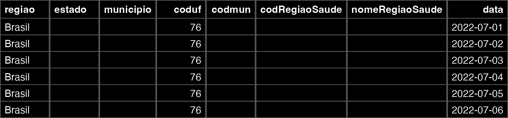
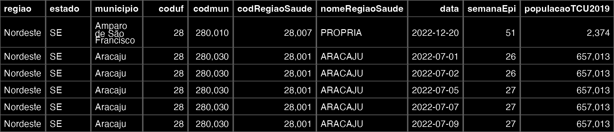
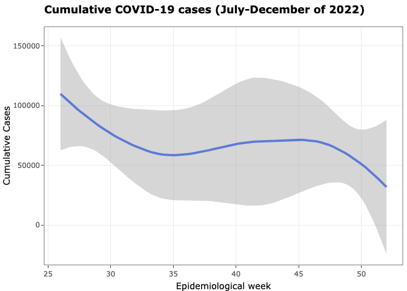
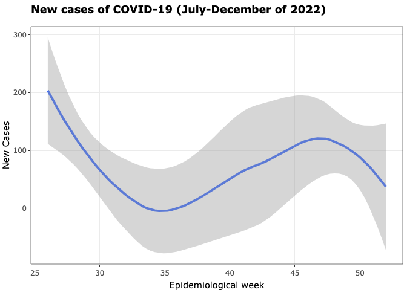
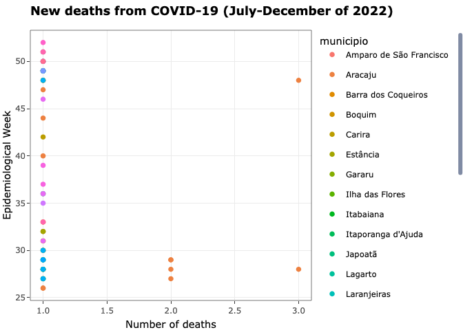
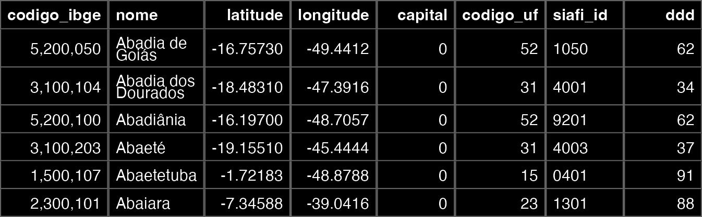
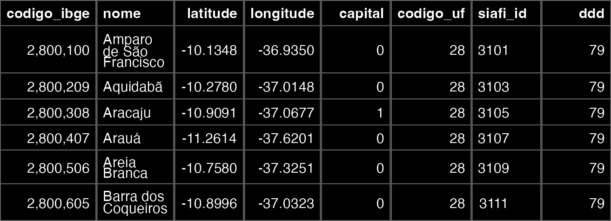
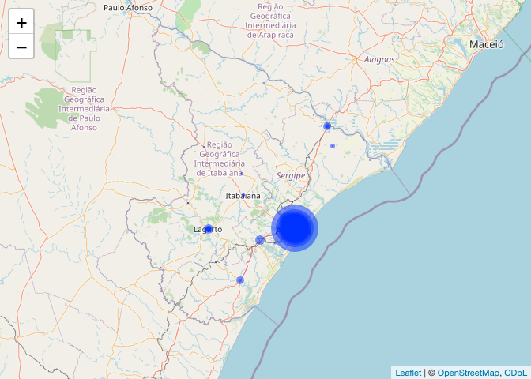

COVID-19 Mapping
================
Lino Sergio Rocha Conceição
2023-10-26

## 1. **Introduction**

- Epidemiological analysis with maps plays a vital role in understanding
  behavior of several diseases and conditions. Mapping them allows us to
  understand their geographic and temporal spread, identify critical
  areas, and help understand demographic and socioeconomic inequalities.
  In addition, they guide public health decision-making, including
  resource allocation and implementation of preventive measures.

- The COVID-19 pandemic has brought a major epidemiological challenge.
  Even recently, we can, through analysis of available databases,
  observe the epidemiological behavior of this condition.

- Several tools are available for this data analysis. Here we’re going
  to use the **R** language.

- Packages required for this analysis: **leaflet**, **sf**,
  **Tidyverse**, **geobr**. If you haven’t previously installed it, use
  the *install.packges()* command.

- The packages **plotly** and **flextable** will be used to generate
  interactives graphs and render tables.

``` r
library(leaflet)
library(sf)
library(tidyverse)
library(geobr)
library(plotly)
library(flextable)
```

## 2. **Datasets**

- The databases available for the analysis of COVID-19 in Brazil are
  available. We will use the data available in
  [OpenDataSUS](https://opendatasus.saude.gov.br/) or [Coronavirus
  disease case panel 2019 (COVID-19) in Brazil by the Ministry of
  Health](https://covid.saude.gov.br/).

``` r
data <- read_csv2("PAINEL_COVIDBR_2022_Parte2_13out2023.csv")

tab <- flextable(head(data[,1:8])) 

tab %>% 
  bg(bg= "black", part = "all") %>% 
  color(color = "white", part = "all") %>% 
  theme_box()
```



- The database is extensive, we have 1,017,029 observations. We can
  observe that the available database has a significant number of
  missing values. In addition, we are going to do a more centralized
  analysis in the state of Sergipe.

``` r
data1 <- data %>% 
  filter(estado == "SE",
         !is.na(municipio),
         casosNovos > 0,
         obitosNovos > 0)

tab1 <- flextable(head(data1[,1:10]))

tab1 %>% 
  bg(bg= "black", part = "all") %>% 
  color(color = "white", part = "all") %>% 
  align_text_col(align = "center") %>% 
  align_nottext_col(align = "center") %>% 
  theme_box()
```



## 3. **Data Visualization**

- Now we will perform some visualizations of the dataset.

``` r
img <- ggplot(data1) +
  geom_smooth(aes(x = semanaEpi, y = casosAcumulado)) +
  ggtitle("<b>Cumulative COVID-19 cases (July-December of 2022)<b>") +
  ylab("Cumulative Cases") +
  xlab("Epidemiological week") +
  theme_bw()

ggplotly(img)
```

<!-- -->

- Data visualization for new cases in 2022.

``` r
img2 <- ggplot(data1) +
  geom_smooth(aes(x = semanaEpi, y = casosNovos)) +
  ggtitle("<b>New cases of COVID-19 (July-December of 2022)<b>") +
  ylab("New Cases") +
  xlab("Epidemiological week") +
  theme_bw()

ggplotly(img2)
```

<!-- -->

- Data visualization for new deaths from COVID-19 in 2022.

``` r
img3 <- ggplot(data1) +
  geom_point(aes(x = obitosNovos, y = semanaEpi, color = municipio)) +
  ggtitle("<b>New deaths from COVID-19 (July-December of 2022)<b>") +
  ylab("Epidemiological Week") +
  xlab("Number of deaths") +
  theme_bw()

ggplotly(img3)
```

<!-- -->

## 4. **Geolocation Data**

- To correctly map COVID-19 cases, we need to obtain information related
  to the geolocation of the regions we want to map, in this case, the
  municipalities of the state of Sergipe. There is a repository
  available at [GitHub
  page](https://github.com/kelvins/Municipios-Brasileiros) (provided by
  Kelvins) that has the latitude and longitude data for each Brazilian
  municipality.

### 4.1 **Data from Brazilian municipalities**

``` r
cities_lat_long <- read_csv("municipios.csv")

tab3 <- flextable(head(cities_lat_long[,1:8]))

tab3 %>% 
  bg(bg= "black", part = "all") %>% 
  color(color = "white", part = "all") %>% 
  align_text_col(align = "center") %>% 
  align_nottext_col(align = "center") %>% 
  theme_box()
```



- With the corresponding data from each Brazilian municipality, we are
  now going to create another database only with the municipalities of
  the state of Sergipe. Note that we can do this by identifying the code
  referring to the state and filtering the data of interest.

### 4.2 **Municipalities in the state of Sergipe**

``` r
SE_cities <- cities_lat_long %>% 
  filter(codigo_uf == 28)

tab4 <- flextable(head(SE_cities[,1:8]))

tab4 %>% 
  bg(bg= "black", part = "all") %>% 
  color(color = "white", part = "all") %>% 
  align_text_col(align = "center") %>% 
  align_nottext_col(align = "center") %>% 
  theme_box()
```



### 4.3 **Final database for mapping**

- Now we need to merge the data regarding the COVID-19 pandemic in the
  state of Sergipe and the data regarding the latitude and longitude of
  the municipalities.

``` r
data_covid19 <- left_join(data1, SE_cities, by = c("municipio" = "nome"))

tab5 <- flextable(head(data_covid19[,1:10]))

tab5 %>% 
  bg(bg= "black", part = "all") %>% 
  color(color = "white", part = "all") %>% 
  align_text_col(align = "center") %>% 
  align_nottext_col(align = "center") %>% 
  theme_box()
```


## 5. **Case mapping**

- Now, with the final dataset, we can create the map with the package
  **leaflet**

``` r
map_total_cases <- leaflet(data_covid19) %>% addTiles() %>% 
  addCircleMarkers(
    radius = ~sqrt(data_covid19$casosNovos),
    fillOpacity = 0.5, stroke = F, 
    popup = paste0("<b>City: </b>", data_covid19$municipio,"<br>",
                   "<b>Confirmed Cases: </b>", data_covid19$casosNovos),
    label = ~municipio)


map_total_cases
```

<!-- -->

## 6. **Conclusion**

- Data analysis and visualization has become a great ally of public
  health. The mapping of various health conditions is of great
  importance for epidemiological surveillance and decision-making in
  healthcare. Furthermore, it adds a great value for upcoming public
  health policies.
